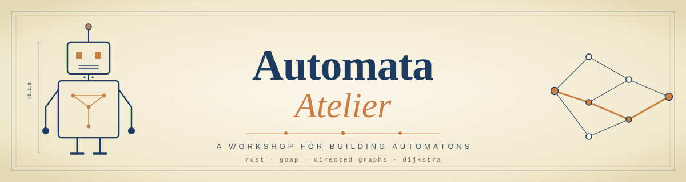

<p align="center">
  
</p>

# Automata Atelier

A workshop for building **automatons** — small, autonomous agents that sense the world, plan a path through it, and act. Every automaton in this atelier is built on the same foundation: directed graphs and shortest-path search. What differs is the planner on top, the surface they expose, and the kind of work they're aimed at.

The first resident is `uncharles`, a GOAP-driven shell-task automaton. More are planned — different planners, different engines, different purposes — but all sharing the same graph-theoretic backbone.

## What's in here

| Crate | Role |
|---|---|
| [`grafo`](grafo/) | Fast directed-acyclic-graph library with Dijkstra search and attribute-based path filtering. The shared kernel underneath every automaton in the atelier. |
| [`goap-planner`](goap-planner/) | Pure GOAP library on top of `grafo`. Defines `State`, `Action`, `Goal`, `Plan`, `Planner`. No I/O, no opinion on how state is observed. The first planner; future planners (HTN, BT, custom) will sit alongside it. |
| [`uncharles`](uncharles/) | Sense → plan → act runtime CLI. Loads a YAML config describing sensors and actions, drives `goap-planner`, optionally executes the plan and replans on divergence. The first automaton built in this atelier. |

The boundaries are deliberate: `grafo` knows nothing about planning, planners know nothing about the real world, and automatons are where every side effect (shell exec, YAML parsing, signal handling) lives. New planners and new automatons slot in at the same layer as their existing siblings — they don't reach down.

## How an automaton is built

```
       ┌─────────────────────────────────────────────────────┐
       │  Automatons                  uncharles · …          │
       │   (CLI · config · I/O · side effects · loop)        │
       └────────────────────┬────────────────────────────────┘
                            │  uses
       ┌────────────────────▼────────────────────────────────┐
       │  Planners                    goap-planner · …       │
       │   (state · actions · goals · plans)                 │
       └────────────────────┬────────────────────────────────┘
                            │  uses
       ┌────────────────────▼────────────────────────────────┐
       │  Graph kernel                grafo                  │
       │   (DAG · CSR storage · Dijkstra · filtered search)  │
       └─────────────────────────────────────────────────────┘
```

Each layer is a swap-point. Add a new planner and existing automatons can use it; build a new automaton and it can pick whichever planner fits its domain. The kernel underneath stays the same.

## Quick start

### As a library — plan a sequence of actions with `goap-planner`

```rust
use goap_planner::{Action, Goal, Planner, State};

let actions = vec![
    Action::new("chop_tree", 5.0).requires("has_axe").adds("has_log"),
    Action::new("split_log", 2.0)
        .requires("has_log")
        .adds("has_firewood")
        .removes("has_log"),
];

let initial = State::from_facts(["has_axe"]);
let goal = Goal::new().requires("has_firewood");

let plan = Planner::new(actions).plan(&initial, &goal).unwrap().unwrap();
assert_eq!(plan.steps, vec!["chop_tree", "split_log"]);
assert_eq!(plan.cost, 7.0);
```

### As a CLI — run `uncharles`, the YAML-driven shell automaton

Describe sensors (shell probes that read the world) and actions (shell commands with preconditions, effects, and a cost):

```yaml
# deploy.yaml
sensors:
  - name: code_committed
    cmd: ["git", "diff", "--quiet", "HEAD"]

actions:
  - name: run_tests
    cost: 2.0
    requires: [code_committed]
    adds: [tests_pass]
    cmd: ["cargo", "test"]

  - name: build_image
    cost: 5.0
    requires: [tests_pass]
    adds: [image_built]
    cmd: ["docker", "build", "-t", "api:latest", "."]

  # ...

goal:
  requires: [smoke_tests_pass]
```

Plan once and print the steps:

```sh
cargo run -p uncharles -- --config uncharles/configs/deploy.yaml --pretty
```

Or actually execute, re-sense, and replan until the goal is satisfied (or something breaks):

```sh
cargo run -p uncharles -- --config uncharles/configs/deploy.yaml --execute --pretty
```

More example configs live in [`uncharles/configs/`](uncharles/configs/).

## Performance

The graph kernel governs what the planners and automatons above it can promise; the planner's BFS layer governs what the runtime can promise. Both core libraries ship with a benchmark suite (Criterion 0.5, release profile, 100 samples) and a CI gate that fails PRs on regressions beyond a configured threshold. See [`docs/performance-tests.md`](docs/performance-tests.md) for the workspace-wide rules.

### `grafo` — graph kernel

Last measured 2026-05-01 on macOS / Rust 1.94.1.

| Workload | Result |
|---|---|
| Selective filter on a 5k-node sparse DAG | **~10 ns** — Dijkstra exits at first failing node |
| `shortest_path_cost` on a 10k-node fan=4 DAG | **4.78 µs** |
| `shortest_path_cost` on a 100k-node chain (worst-case path length) | **648 µs** |
| Construction, 1k-node sparse DAG | **89 µs** (~78% faster than the pre-optimization baseline) |
| Construction, 500k-node sparse DAG with Rayon | **43 ms** |
| 512 parallel queries via Rayon over a shared `Arc<Graph>` | **914 µs** — scales near-linearly with cores |
| Attribute count 1 → 20 per node (filter throughput) | **flat at ~10 ns** — O(1) `FxHashSet` lookup |

Canonical summary: [`grafo/docs/performance.md`](grafo/docs/performance.md).

### `goap-planner` — GOAP planner

Last measured 2026-05-02 on macOS / Rust stable.

| Workload | Result |
|---|---|
| 5-step linear plan | **3.3 µs** |
| 50-step linear plan | **32 µs** |
| 128-action library, single correct branch | **337 µs** |
| 16 redundant paths, picks the cheapest | **23 µs** |
| Goal already satisfied (fast-path early return) | **7.2 ns** |
| `Action::applicable` (preconditions met / unmet) | **16 ns / 13 ns** |
| 64 concurrent plans via Rayon over `Arc<Planner>` | **148 µs** (5.2× faster than sequential) |

Canonical summary: [`goap-planner/docs/performance.md`](goap-planner/docs/performance.md).

`uncharles` has no benchmarks yet — its hot path is shell exec, which is dominated by the cost of the commands it runs, not by uncharles itself. A bench will be added when there's a real workload showing measurable runtime overhead independent of the actions being executed.

## Building and testing

The workspace uses Rust edition 2024.

```sh
cargo build --workspace
cargo test --workspace
cargo fmt --all
cargo clippy --all-targets --all-features -- -D warnings
```

Benchmarks for the core libraries:

```sh
cargo bench -p grafo
cargo bench -p goap-planner
```

Pair every bench session with a flamegraph (see [`grafo/CLAUDE.md`](grafo/CLAUDE.md) and [`goap-planner/CLAUDE.md`](goap-planner/CLAUDE.md)). PRs that touch a core library run the suite in CI via [`.github/workflows/bench.yml`](.github/workflows/bench.yml).

## Where to look next

- [`grafo/README.md`](grafo/README.md) — full graph library docs and standalone examples.
- [`grafo/docs/performance.md`](grafo/docs/performance.md) — current grafo benchmark summary and history.
- [`goap-planner/README.md`](goap-planner/README.md) — planner library docs.
- [`goap-planner/docs/performance.md`](goap-planner/docs/performance.md) — current planner benchmark summary and history.
- [`goap-planner/examples/`](goap-planner/examples/) — runnable planner scenarios (`deploy`, `release`, `refactor`, `validate`, `watch`, `dependency`).
- [`uncharles/configs/`](uncharles/configs/) — YAML configs showing sensor/action/goal patterns.
- [`docs/performance-tests.md`](docs/performance-tests.md) — workspace-wide rules for benchmark suites and the CI gate.
- [`docs/todo.md`](docs/todo.md) — deferred design notes and pending work.

## License

MIT
