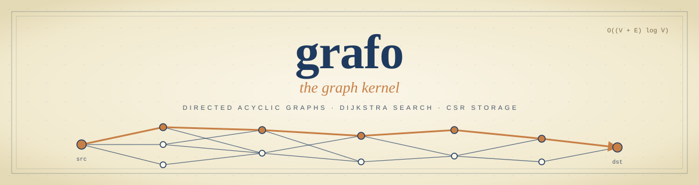

<p align="center">
  
</p>

# Grafo

A fast directed acyclic graph (DAG) library for Rust with shortest-path search and attribute-based path filtering inspired by Goal-Oriented Action Planning (GOAP).

## Features

- **CSR storage** — O(V + E) memory, cache-friendly edge traversal
- **Dijkstra search** — binary heap with lazy stale-entry removal
- **Node attributes** — attach string tags to nodes; O(1) membership checks via `HashSet`
- **Filtered search** — predicate closure acts as a per-node precondition, pruning the frontier during search
- **Cost-only variants** — skip predecessor storage and path reconstruction
- **Thread-safe** — `Graph` is `Send + Sync`; share across threads with `Arc`
- **Parallel construction** — Rayon-backed edge resolution and sort; FxHashMap label interning

## Installation

Add to your `Cargo.toml`:

```toml
[dependencies]
grafo = "0.1"
```

## Usage

### Basic shortest path

```rust
use grafo::Graph;

let graph = Graph::new(
    &["a", "b", "c", "d"],
    &[
        ("a", "b", 1.0),
        ("a", "c", 4.0),
        ("b", "c", 2.0),
        ("b", "d", 5.0),
        ("c", "d", 1.0),
    ],
)
.unwrap();

let result = graph.shortest_path("a", "d").unwrap().unwrap();
assert_eq!(result.cost, 4.0);
assert_eq!(result.resolve_labels(&graph), vec!["a", "b", "c", "d"]);
```

### Attribute-based filtering

Attach tags to nodes and pass a predicate to constrain which nodes the search may visit.
Nodes failing the predicate — including source and destination — are pruned entirely.

```rust
use grafo::{Graph, NodeAttrs};

let graph = Graph::new_with_attrs(
    &[
        ("London",     &["taxi", "bus", "train"][..]),
        ("Oxford",     &["bus"][..]),             // no taxi stop
        ("Birmingham", &["taxi", "bus", "train"][..]),
        ("Manchester", &["taxi", "bus", "train"][..]),
    ],
    &[
        ("London",     "Oxford",      60.0),
        ("London",     "Birmingham", 150.0),
        ("Oxford",     "Birmingham",  45.0),
        ("Oxford",     "Manchester", 120.0),
        ("Birmingham", "Manchester",  90.0),
    ],
)
.unwrap();

// Oxford has no taxi stop — the search skips it and routes via Birmingham.
let r = graph
    .shortest_path_filtered("London", "Manchester", |attrs: &NodeAttrs| {
        attrs.contains("taxi")
    })
    .unwrap()
    .unwrap();

assert_eq!(r.resolve_labels(&graph), vec!["London", "Birmingham", "Manchester"]);
assert_eq!(r.cost, 240.0);
```

### Cost-only search

When you only need the cost, use the `_cost` variants to skip path reconstruction:

```rust
let cost = graph.shortest_path_cost("a", "d").unwrap();
let cost = graph.shortest_path_filtered_cost("London", "Manchester", |a: &NodeAttrs| {
    a.contains("taxi")
}).unwrap();
```

### Repeated cost queries

Reuse a caller-owned workspace when searches repeatedly explore a small part of a large graph:

```rust
use grafo::{Graph, SearchWorkspace};

let graph = Graph::new(&["a", "b", "c"], &[("a", "b", 1.0), ("b", "c", 2.0)]).unwrap();
let mut workspace = SearchWorkspace::new();
assert_eq!(graph.shortest_path_cost_with_workspace("a", "c", &mut workspace).unwrap(), Some(3.0));
assert_eq!(graph.shortest_path_filtered_cost_with_workspace(
    "a", "c", |_| true, &mut workspace,
).unwrap(), Some(3.0));
```

The workspace reuses distances, generation stamps and heap capacity. It can be reused across different graphs and sizes, including after a filter panic unwinds. Allocate one workspace per simultaneous worker; the graph remains immutable. Distance/stamp elements use **12 bytes per retained vertex slot**. Buffers retain their peak size; spare vector/heap capacity and allocator overhead add to this storage. Drop the workspace to release its memory.

First use and growth initialize buffers; a generation rollover clears retained stamps. Warm narrow searches can benefit, but cold, broad and mixed queries may not. Existing methods remain the default for one-shot searches, and full-path methods do not use a workspace. See [ADR 0006](../docs/adrs/0006-use-caller-owned-search-workspaces.md) for the decision and its origin.

### Concurrent queries

`Graph` is `Send + Sync`. Wrap in `Arc` to share across threads with no synchronisation overhead:

```rust
use std::sync::Arc;
use grafo::Graph;

let graph = Arc::new(Graph::new(...).unwrap());

let handles: Vec<_> = queries
    .iter()
    .map(|&(from, to)| {
        let g = Arc::clone(&graph);
        std::thread::spawn(move || g.shortest_path_cost(from, to))
    })
    .collect();
```

### Examples

```bash
cargo run --example basic                # minimal graph + path query
cargo run --example city_routes          # road network with transport-mode filtering
cargo run --example build_pipeline       # CI/CD dependency graph with error handling
cargo run --example concurrent_queries   # Arc<Graph> shared across threads with Rayon
cargo run --example goap_quest_planner   # GOAP: RPG dungeon with warrior/rogue/mage classes
cargo run --example goap_robot_delivery  # GOAP: warehouse delivery with robot capability constraints
```

## Performance highlights

The optional workspace trades retained memory and setup cost for less repeated initialization. Measure representative workloads before opting in; it is not universally faster.

Run workspace controls with `cargo bench -p grafo-dag --bench workspace`; the existing suite remains `cargo bench -p grafo-dag --bench performance`.

Canonical summary with full tables and trade-offs: [`docs/performance.md`](docs/performance.md). Per-change deltas live in dated [`docs/perf-comparison-YYYY-MM-DD.md`](docs/perf-comparison-2026-05-01.md) snapshots; the first full sweep is in [`docs/benchmarks-2026-04-20.md`](docs/benchmarks-2026-04-20.md).

## Contributing

1. Fork the repository and create a feature branch.
2. Run the test suite before opening a pull request: `cargo test`
3. Run benchmarks if your change touches search or construction: `cargo bench`
4. Keep public API changes backward-compatible or discuss them in the PR first.

## License

MIT
