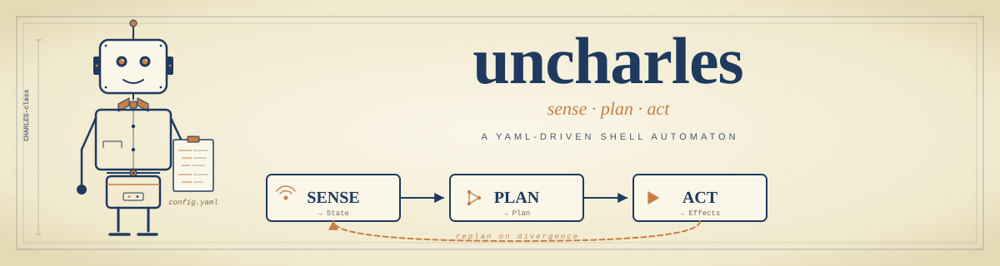

<p align="center">
  
</p>

# uncharles

Sense → plan → act runtime that drives [`goap-planner`](../goap-planner/) from a YAML config. The first automaton built in the [Automata Atelier](../) workspace.

`uncharles` reads a config that declares **sensors** (shell probes that read the world) and **actions** (shell commands with preconditions, effects, and a cost). On each cycle it runs the sensors to derive the current state, asks `goap-planner` for the cheapest plan to the goal, and either prints the plan or executes it step by step — re-sensing between steps so divergence triggers a replan rather than blind execution.

## Features

- **YAML-first** — describe the world in declarative `sensors` / `actions` / `goal` lists. No Rust required for new automatons.
- **Sense → plan → act loop** — each cycle is independent; replanning on divergence is the default failure mode.
- **Plan-only or execute** — `--pretty` prints the plan; `--execute` runs it. Same config, two modes.
- **Graceful shutdown** — `Ctrl+C` interrupts between steps, never mid-action.

## Installation

This crate is a workspace member, not yet published to crates.io.

```sh
cargo build -p uncharles --release
```

## Usage

`uncharles` exposes two subcommands. The legacy flat form
(`uncharles --config X`) still works — it is parsed as `uncharles run`.

### `run` — sense, plan, optionally execute

Plan a sequence and print it:

```sh
cargo run -p uncharles -- run --config uncharles/configs/deploy.yaml --pretty
```

Execute the plan, re-sensing and replanning on divergence:

```sh
cargo run -p uncharles -- run --config uncharles/configs/deploy.yaml --execute --pretty
```

### `inspect` — visualise the state-action graph

Load a config and print the static structure plus the bounded reachable
state-action graph **without running any sensor or action commands**.
Useful for debugging configs that produce no plan, surfacing typo'd fact
names, orphan actions, unreachable goal facts, and dead-end states.

```sh
cargo run -p uncharles -- inspect --config uncharles/configs/deploy.yaml
```

The initial state is *simulated* — each sensor's `on_success` effects are
applied in YAML declaration order without running anything. Use `--have
<fact>` to layer additional facts on top, and `--max-states <N>` to override
the planner's default exploration cap (10 000). Exit code is `0` when the
config is clean, `1` when static analysis finds issues, `2` if the config
could not be loaded.

#### Output formats

`--format <text|dot|mermaid|json>` selects how the inspection report is
rendered. Default is `text` (the human-readable six-section report).

```sh
# Visual graph in your terminal via graph-easy (Perl):
brew install graph-easy
cargo run -q -p uncharles -- inspect --config X.yaml --format dot \
  | graph-easy --as=boxart

# Or pipe Graphviz to chafa for an image-based ASCII rendering:
cargo run -q -p uncharles -- inspect --config X.yaml --format dot \
  | dot -Tpng | chafa -

# In iTerm2 or Kitty you can render the real image inline:
cargo run -q -p uncharles -- inspect --config X.yaml --format dot \
  | dot -Tpng | imgcat                # iTerm2
cargo run -q -p uncharles -- inspect --config X.yaml --format dot \
  | dot -Tpng | kitty +kitten icat    # Kitty

# Mermaid for Markdown viewers / mermaid.live:
cargo run -q -p uncharles -- inspect --config X.yaml --format mermaid

# JSON for piping to jq or other tooling:
cargo run -q -p uncharles -- inspect --config X.yaml --format json \
  | jq '.static_analysis'
```

In all formats, initial state is filled blue, goal-satisfying states are
filled green, and any state that is *both* (rare) is filled orange. DOT
and Mermaid include the static-analysis findings as `//` and `%%`
comments respectively; JSON exposes them as a structured `static_analysis`
field. Exit codes are unchanged across formats.

Implements [issue #22](https://github.com/leopepe/automata-atelier/issues/22).

A minimal config:

```yaml
sensors:
  - name: code_committed
    cmd: ["git", "diff", "--quiet", "HEAD"]

actions:
  - name: run_tests
    cost: 2.0
    requires: [code_committed]
    adds: [tests_pass]
    cmd: ["cargo", "test"]

goal:
  requires: [tests_pass]
```

Actions also accept a `forbids` field — facts that must be **absent** for
the action to fire (mirrors `goal.forbids`). Lets you express "do this
only when X is not present" directly, instead of inventing a synthetic
sensor that observes the negative shape:

```yaml
actions:
  - name: install_tools
    cost: 5.0
    forbids: [tools_installed]   # only fire when tools are missing
    adds: [tools_installed]
    cmd: ["brew", "install", "..."]
```

A fact in both `requires` and `forbids` on the same action is rejected
at config-load time as a `ConfigError::ActionContradiction` (the action
would be structurally unsatisfiable). See `pendrive_audit.yaml` for a
real-world migration of two synthetic-sensor proxies onto `forbids`.

## Example configs

Real configs covering different domains — read them as a tour of what the runtime can express:

| Config | What it does |
|---|---|
| [`deploy.yaml`](configs/deploy.yaml) | Service deployment pipeline (test → build → push → deploy → smoke) |
| [`release_watch.yaml`](configs/release_watch.yaml) | Long-lived release-tagging watcher |
| [`tofu_drift_watch.yaml`](configs/tofu_drift_watch.yaml) | Post-apply OpenTofu/IaC convergence watcher (drift detection, readonly creds — see [ADR 0002](../docs/adrs/0002-uncharles-as-post-apply-iac-convergence-watcher.md)) |
| [`merge_gate.yaml`](configs/merge_gate.yaml) | PR-merge gate with status-check sensors |
| [`podcast.yaml`](configs/podcast.yaml) | Podcast-episode download pipeline (RSS → fetch → archive) |
| [`repo_validate.yaml`](configs/repo_validate.yaml) | Repo-validation pipeline (fmt + clippy + test) |
| [`smoke_loop.yaml`](configs/smoke_loop.yaml) / [`smoke_recover.yaml`](configs/smoke_recover.yaml) / [`smoke_failure.yaml`](configs/smoke_failure.yaml) | Side-effect-free smoke configs used by the integration tests |

## Architecture

```
┌─────────────────────────────────────────────┐
│  uncharles  (this crate)                    │
│   YAML · sensors · actions · loop · I/O     │
└────────────────────┬────────────────────────┘
                     │  uses
┌────────────────────▼────────────────────────┐
│  goap-planner                               │
│   state · action · goal · plan              │
└────────────────────┬────────────────────────┘
                     │  uses
┌────────────────────▼────────────────────────┐
│  grafo                                      │
│   DAG · CSR storage · Dijkstra              │
└─────────────────────────────────────────────┘
```

Side effects (shell exec, YAML parsing, signal handling) live here, not in the layers below. Cloud-specific adapters and any future I/O glue belong in `uncharles` (or a sibling runtime crate), never in `goap-planner`.

## Contributing

1. Read [`CLAUDE.md`](CLAUDE.md) (when present) and the workspace [`CLAUDE.md`](../CLAUDE.md) before opening a PR.
2. Run the test suite: `cargo test -p uncharles`.
3. Side-effect-free integration tests live in `tests/` against the smoke configs — extend those when changing the loop.

## License

MIT
